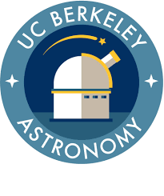

# About me

I'm an astrophysics PhD candidate at UC Berkeley. Welcome to my GitHub.

---
### 🔗 Webpages

My personal website is currently hosted here: [w.astro.berkeley.edu/~charada/](https://w.astro.berkeley.edu/~charada/index.html)

**BUT** I'm actively relocating that site to a more permanent home: [calebharada.github.io](https://calebharada.github.io)

*Check back for updates!*

---
### 🔭 Research

I study **exoplanets** using a variety of tools. 

My ongoing project **SPORES-HWO** (System Properties and Observational Recconnaisance for Exoplanet Studies with the Habitable Worlds Observatory) is currently hosted [here](https://sites.google.com/berkeley.edu/spores-hwo), but will likewise be relocated to [calebharada.github.io/spores](https://calebharada.github.io/spores) over time.

---

<!--
**CalebHarada/CalebHarada** is a ✨ _special_ ✨ repository because its `README.md` (this file) appears on your GitHub profile.

Here are some ideas to get you started:

- 🔭 I’m currently working on ...
- 🌱 I’m currently learning ...
- 👯 I’m looking to collaborate on ...
- 🤔 I’m looking for help with ...
- 💬 Ask me about ...
- 📫 How to reach me: ...
- 😄 Pronouns: ...
- ⚡ Fun fact: ...
-->
